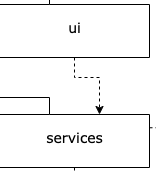
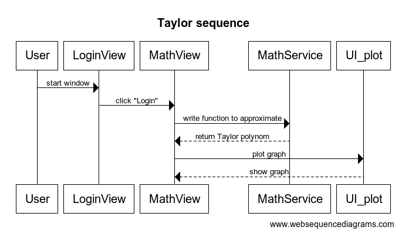
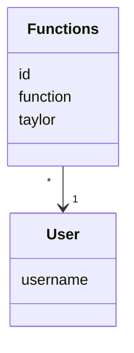

# Arkkitehtuurikuvaus

Ohjelma noudattaa pakkauskaaviota

Repositoriota ja Entityä ei ole vielä toteuttu normaaliin pakkauskaavio rakenteeseen, koska tietokanta puuttuu.

## Sovelluslogiikka

Toiminnallisuuksista vastaa olio Math_Service. Luokka tarjoaa toiminnoille metodit:
- define(function)
- taylor(function

Olio Ui_plot huolehtii luotujen funktioiden graafisesta esityksestä metodille:
- plotting(function, taylor)

## Päätoiminnallisuudet

Tällä hetkellä oleva toiminnallisuus on esitetty seuraavassa sekvenssikaaviossa:

## Tulevat ominaisuudet

Seuraavaksi luodaan tietokanta, jolla pidetään muistissa käyttäjät ja heidän tutkimansa funktiot.

Tietomallin, jota ei ole vielä toteutettu muodostavat User ja Functions.

Tällöin pakkauskaavio noudattaa seuraavaa:

