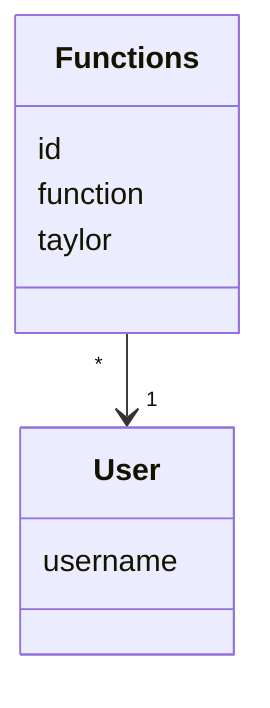

# Arkkitehtuurikuvaus

## Sovelluslogiikka

Tietomallin, jota ei ole vielä toteutettu muodostavat User ja Functions.

Toiminnallisuuksista vastaa olio Math_Service. Luokka tarjoaa toiminnoille metodit:
- define(function)
- taylor(function

Olio Ui_plot huolehtii luotujen funktioiden graafisesta esityksestä metodille:
- plotting(function, taylor)

## Päätoiminnallisuudet

Tällä hetkellä toiminnallisuus on

aloitusikkuna --näkymän vaihtaminen--> matematiikkaikkuna --toiminnallisuus--> graafinen esitys

Seuraavaksi luodaan tietokanta, jolla pidetään muistissa käyttäjät ja heidän tutkimansa funktiot.

