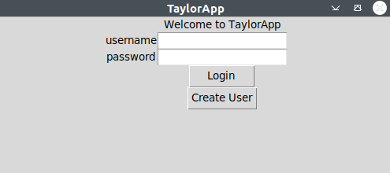
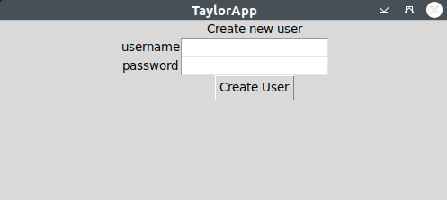
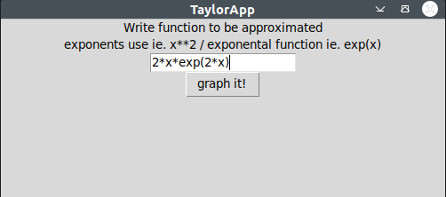
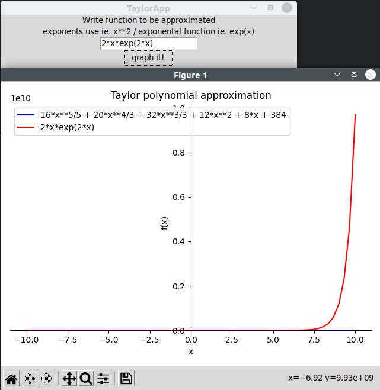

# Käyttöohje

Lataa projektin viimeisimmän [releasen](https://github.com/hnenonen/ot-harjoitustyo/tree/master/python-math-plot/releases) lähdekoodi valitsemalla "Source code" Assets-osion alta.

### Konfigurointi

Ei ole tarvetta konfiguroida mitään.

### Ohjelman käynnistäminen

Ennen ohjelman käynnistämistä, asenna riippuvuudet komennolla:

```bash
poetry install
```


Nyt ohjelman voi käynnistää komennolla:

```
poetry run invoke start
```

### "Kirjautuminen"



"Kirjaudu" ohjelmaan painamalla "Login".
"Luo" uusi käyttäjä painamalla "Create User".

### "UUden käyttäjän luominen"



"Luo" uusi käyttäjä painamalla "Create User". 

### Taylor polynomin luominen ja plottaus



Kirjoita funktio, jolle haluat approksimoida taylor polynomin.

Paina "graph it!" ja sovellus plottaa funktion ja sitä approksimoivan polynomin.  



Tätä voi toistaa niin monta kertaa kuin haluaa. Syöttää vain uuden funktion ja painaa "graph it!".

### Lopettaminen

Ohjelman saa lopetettu painamalla oikeasta yläkulmasta raksia.

