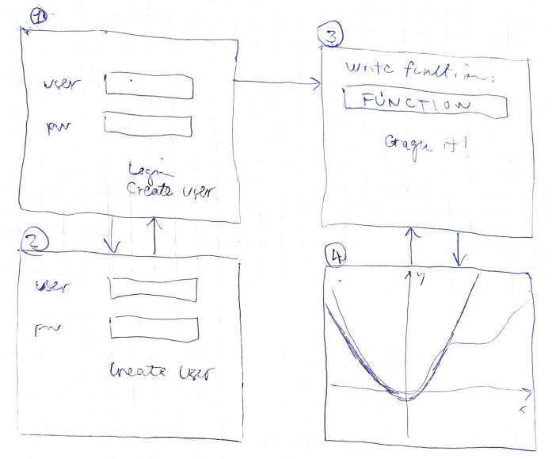

# Vaatimusmäärittely

## Sovelluksen tarkoitus

Sovelluksen avulla käyttäjä voi laskea antamalleen funktiolle määräämässään pisteessä approksimoivan Taylor polynomin.

## Käyttäjät

Ei ole eriteltyjä käyttäjiä. Kaikilla samat oikeudet.

## Käyttöliittymäluonnos ja perusversion toiminnallisuus

### Ennen kirjautumista

Käyttäjä aloittaa näkymästä 1., jossa valittava "Login" tai "Create user".
Ohjelmaa pääsee käyttämään valitsemalla "Login".

Ns. rekisteröinti näkymään pääse painamalla "Create User".(näkymä 2).

Ohjelmassa ei ole tietokantaa, joten käyttäjän tietoja ei tallenneta mihinkään.
"username" ja "password" kenttiin ei siis tarvitse siis syöttää mitään.

### Kirjautumisen jälkeen

Käyttäjä voi generoida uuden funktion tutkimisen syöttämällä haluamansa funktion ja painamalla "graph it!". (näkymä 3)

### Tutkimuksen ajon jälkeen

Käyttäjä näkee kuvaajan, jossa tutkittu funktio sekä sitä vastaan generoitu Taylor polynomi. (näkymä4)

Käyttäjä voi ajaa uuden tutkimuksen edelleen näkyvillä olevasta näkymästä 3 ja painamalla "graph it!", jolloin kuvaaja päivittyy.

## Jatkokehitysideoita

Perusversion jälkeen sovellusta täydennetään ajan salliessa mm. seuraavasti:

- Luoda tietokanta, johon voidaan tallettaa useita eri käyttäjiä ja heidän tekemät taylor approksimaatiot
- Toteuttaa funktion plottaus niin, että uuden ikkunan sijasta se päivittyy olemassa olevaan ikkunaan.
- Luoda käyttäjälle raportti tutkimuksesta
- Mahdollisuus dynaamisesti muuttaa tarkastelupistettä x
- Mahdollisuus dynaamisesti muuttaa haluttua tarkkuutta
- Numeerinen tapa derivoida / löytää funktion nollakohta, Newton menetelmä

kts. esimerkiksi: 
