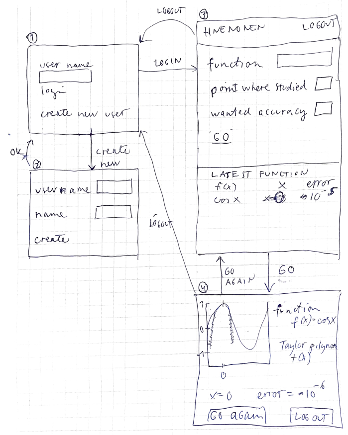

# Vaatimusmäärittely

## Sovelluksen tarkoitus

Sovelluksen avulla käyttäjä voi laskea antamalleen funktiolle määräämässään pisteessä approksimoivan Taylor polynomin.
Sovellusta on mahdollista käyttää useamman rekisteröityneen käyttäjän, jotka kaikki näkevät omat aiemmin ajamansa funktiot ja käyttämänsä parametrit.
Näiden avulla on helppo regeneroida ajo uudelleen.

## Käyttäjät

Alkuvaiheessa sovelluksella on vain yksi käyttäjärooli, normaalikäyttäjä. Myöhemmin sovellukseen lisätään pääkäyttäjä, jolla on suuremmat oikeudet.

## Käyttöliittymäluonnos ja perusversion toiminnallisuus

### Ennen kirjautumista

Käyttäjä voi luoda järjestelmään käyttäjätunnuksen, jolloin siirrytään näkymään 2.

Käyttäjä voi kirjautua järjestelmään, jolloin siirrytään näkymään 3. [login_view luotu]

### Kirjautumisen jälkeen

Käyttäjä näkee aiemmin tutkimansa funktiot ja parametrit sekä pari malliajoa

Käyttäjä voi generoida uuden funktion tutkimisen, jolloin siirrytään näkymään 4. [math_view luotu ja toiminnallisuus]

Käyttäjä voi kirjautua ulos, jolloin siirrytään näkymään 1.

### Tutkimuksen ajon jälkeen

Käyttäjä näkee kuvaajan, jossa tutkittu funktio sekä sitä vastaan generoitu Taylor polynomi sekä käyttämänsä parametrit ja funktion ja polynomin virhe käsitellyssä pisteessä. [plotting metodi, ei oma näkymänsä vaan tekee pop up]

Käyttäjä voi ajaa uuden tutkimuksen, jolloin palataan näkymään 3.

Käyttäjä voi kirjautua ulos, jolloin palataan näkymään 1.

## Jatkokehitysideoita

Perusversion jälkeen sovellusta täydennetään ajan salliessa mm. seuraavasti:

- Luoda käyttäjälle raportti tutkimuksesta
- Mahdollisuus dynaamisesti muuttaa tarkastelupistettä x
- Mahdollisuus dynaamisesti muuttaa haluttua tarkkuutta
- Numeerinen tapa derivoida / löytää funktion nollakohta, Newton menetelmä
